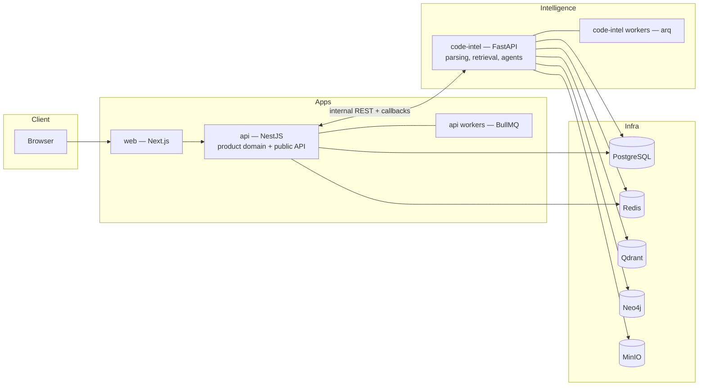

# 01 — System Overview

## Mission

Help enterprises understand, debug, maintain, and modernize large legacy codebases. The platform continuously ingests knowledge (repositories, git history, docs, logs, bug history), maintains a structured code-intelligence layer over it, and exposes that intelligence through specialized AI agents and an enterprise UI.

## The two-layer mental model

Everything in DevMind is one of two things:

1. **The intelligence engine** — deterministic infrastructure that turns raw sources into queryable structure: Tree-sitter parsing, symbol/call/dependency graphs, hybrid retrieval indexes, log fingerprints. This layer is the moat. It must be correct, incremental, and fast at multi-MLOC scale.
2. **The product** — everything a user touches: projects, incidents, conversations, patch reviews, dashboards, auth, audit. This layer must be boringly reliable enterprise software.

Agents sit between the two: they consume the engine through tools and produce product artifacts (root-cause reports, patch proposals, documentation).

## Service topology

Four deployable services plus infrastructure. See [ADR-0002](../adr/0002-service-topology.md).

| Service | Runtime | Responsibility |
| --- | --- | --- |
| `web` | Next.js (App Router), React, TypeScript, Tailwind | All UI. Monaco for code, React Flow for graphs. No business logic; talks only to `api`. |
| `api` | NestJS modular monolith | Product domain: identity, projects, incidents, conversations, patch review, audit. Owns the public API and all user-facing state. BullMQ workers for product-side jobs (webhook processing, notifications, scheduled syncs). |
| `code-intel` | Python FastAPI + arq workers | The engine: repo acquisition, Tree-sitter parsing, graph construction (Neo4j), embedding + hybrid retrieval (Qdrant), log fingerprinting, LangGraph agent execution. Internal-only — never exposed to the internet. |
| Infra | Postgres, Redis, Qdrant, Neo4j, MinIO | See [06-data ownership](#data-ownership) and [09](09-deployment-and-operations.md). |

**Why this shape and not microservices per agent or per module:** the product domain changes together, deploys together, and shares transactions — a modular monolith keeps it coherent (enforced module boundaries inside NestJS, one deployable). The Python service is separate because it has a genuinely different runtime, scaling profile (CPU-heavy parsing, GPU-adjacent embedding, long-running agent graphs), and failure domain. Each of the four services is independently deployable and horizontally scalable, which satisfies the "independently deployable components" requirement without paying the microservices tax on day one.

## Communication patterns

Chosen to avoid cross-language coupling (BullMQ is Node-only) and to keep every interaction observable. See [07 — API Contracts](07-api-contracts.md) for schemas.

1. **Synchronous internal REST** — `api → code-intel` for fast queries (search, symbol lookup, graph neighborhood). OpenAPI-first; the TypeScript client in `packages/shared-types` is generated, never hand-written. Authenticated with a service token (mTLS when we leave Compose).
2. **Async job pattern** — for anything long-running (indexing, agent runs, patch generation): `api` persists a `Job` row (source of truth for status), then `POST`s a command to `code-intel`, which enqueues to its own arq/Redis queue. Workers publish progress events to Redis pub/sub (`events:job:{id}`) and `POST` a signed completion callback to `api`.
3. **Client streaming** — `api` relays job progress and agent/token streams to the browser over SSE. SSE over WebSocket because every flow is server→client, it survives proxies, and reconnection is free.
4. **No shared tables** — services never read each other's database schemas. All cross-service access goes through the contract.

## Data ownership

| Store | Owner | Contents |
| --- | --- | --- |
| PostgreSQL `product` schema | `api` | Users, orgs, projects, incidents, conversations, patches, jobs, audit. |
| PostgreSQL `codeintel` schema | `code-intel` | Index run state, file content hashes (incremental indexing), log events (partitioned), log fingerprints. |
| Neo4j | `code-intel` | Code graph: files, symbols, calls, imports, inheritance, module dependencies. |
| Qdrant | `code-intel` | Dense + sparse (BM25) vectors for code chunks, docs, commits, log templates. |
| Redis | shared, namespaced | BullMQ (`bull:*`), arq (`arq:*`), pub/sub events, caching, rate limiting. |
| MinIO / S3 | `code-intel` primarily | Repo snapshots, large artifacts (patch bundles, generated docs, uploaded log archives). |

One Postgres *instance*, two *schemas* with separate credentials: operationally cheap now, and the schema split means moving `codeintel` to its own instance later is a connection-string change, not a migration.

## Non-negotiable platform rules

- The Patch Engine emits unified-diff artifacts only. Nothing ever writes to a customer repository or production system automatically ([ADR-0007](../adr/0007-patches-are-artifacts.md)).
- Never rely on embeddings alone — every retrieval blends structural (graph/symbol), lexical, and semantic signals ([04](04-hybrid-retrieval.md)).
- Code is never treated as plain text in the engine: chunking, search, and impact analysis are AST/symbol-aware ([03](03-code-intelligence.md)).
- Every agent action is persisted and auditable ([05](05-agents.md)).
